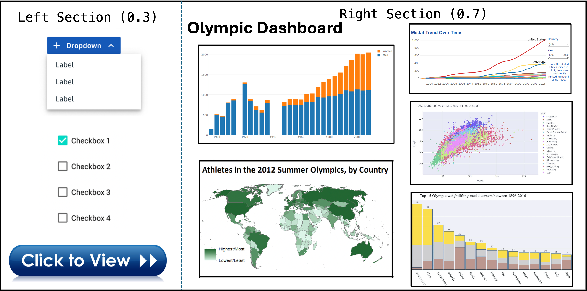

## Project Proposal: Unveiling Olympic Glory Through Data Visualization

**Data:** Olympic Games Dataset (1896-2016)

**Summary:** This project explores a dataset containing information on athletes who participated in the Olympic Games from 1896 to 2016. It includes details like name, gender, age, physical attributes, nationality (NOC), games details (year, season, city), sport, and medal achievements.

**Research Questions:**

1. **Evolution of Participation:** How has athlete participation in the Olympics changed over time, considering factors like gender and region?
2. **Dominant Sports:**  Which sports have historically garnered the most medals? Are there any trends in medal distribution across various sports?
3. **Powerhouse Nations:** Which countries have consistently dominated the Olympics in terms of medal count? Are there any emerging trends in national performance?
4. **Age and Success:** Is there a correlation between an athlete's age and their likelihood of winning a medal? Does this vary across different sports?
5. **Physical Attributes and Performance:** Do physical attributes like height and weight play a role in medal success across various sports?

**Importance and Challenges:**

Visualizing Olympic data is important for understanding trends in athlete participation, national dominance, and the evolution of sports. It can reveal interesting insights into factors influencing athletic success and inspire future generations.

However, presenting this data effectively can be challenging. 

* **Data Volume:**  The dataset spans multiple decades, potentially leading to information overload if not presented strategically.
* **Multi-dimensionality:** Athlete attributes, sports, and national representation create a complex data structure requiring careful selection of chart types for clear communication.
* **Interactive Needs:** The ideal visualization should allow users to explore specific sports, countries, and time periods for deeper analysis.

**Wireframe Sketch:** The wireframe sketch below outlines the layout and components of the proposed dashboard.

**Layout:** The dashboard will be divided into two sections:

* **Left Section:** This section will house interactive filters.
    * **Dropdowns:** Users can filter by Year, Season (Summer/Winter), Sport, and Region (Continents).
    * **Checkbox:** Option to filter by Medal Type (Gold, Silver, Bronze).
* **Right Section:** This section will display the following charts:
    * **Stacked Bar Chart:**  Tracks total athlete participation (by gender) across different Olympic years. 
    * **Choropleth Map:**  Visually depicts medal distribution across participating countries, colored by medal count (Gold, Silver, Bronze). Users can hover over countries for detailed information.
    * **Line Chart:**  Shows the trend in medal count for the top 5 medal-winning countries throughout the years (interactive – highlight a country to see its specific medal count).
    * **Scatter Plot:**  Analyzes the relationship between athlete age and medal success (color-coded by sport). Users can filter by specific sports. 
    * **Bar Chart:**  Compares average height and weight of medal winners (Gold, Silver, Bronze) across different sports (interactive – click on a sport to see the breakdown).

**Functionalities:**

The dashboard will be interactive, allowing users to:

* Filter the data based on their chosen criteria.
* Hover over specific elements on charts for detailed information.
* Highlight data points for a more focused analysis.

**Benefits:**

This interactive data visualization will provide valuable insights into the history and trends of the Olympic Games. It will be beneficial for:

* **Sports Enthusiasts:** Explore historical data and identify trends in participation and medal distribution.
* **Athletes and Coaches:** Gain insights into factors potentially influencing performance in specific sports.
* **Sports Analysts and Journalists:** Analyze data to create compelling stories about Olympic trends. 

**Conclusion:**

This project aims to create a comprehensive and interactive data visualization dashboard. By effectively presenting Olympic data, this project will provide valuable insights for a variety of audiences. 

**References:**
- [Olympic Games Data 1896 - 2016 from Matthew Rautionmaa](https://matthewrautionmaa.shinyapps.io/Olympic_Shiny/); [Github](https://github.com/rautionmaa/Olympic_Shiny)
- [Olympic Summer & Winter Games, 1896-2022](https://www.kaggle.com/datasets/piterfm/olympic-games-medals-19862018)
- [Olympic Games 1986-2022, Data Visualization](https://www.kaggle.com/code/piterfm/olympic-games-1986-2022-data-visualization)
- [Rio 2016 Olympic Games Analysis](https://github.com/flother/rio2016?tab=readme-ov-file)
- [Johns Hopkins University Data Visualization and Dashboarding With R Specialization](https://github.com/mattpinkerton/Johns_Hopkins_Data_Visualization_and_Dashboarding_With_R); [R-Shiny Dashboard](https://matthew-pinkerton.shinyapps.io/Rio_2016_Olympics_Dashboard/)
