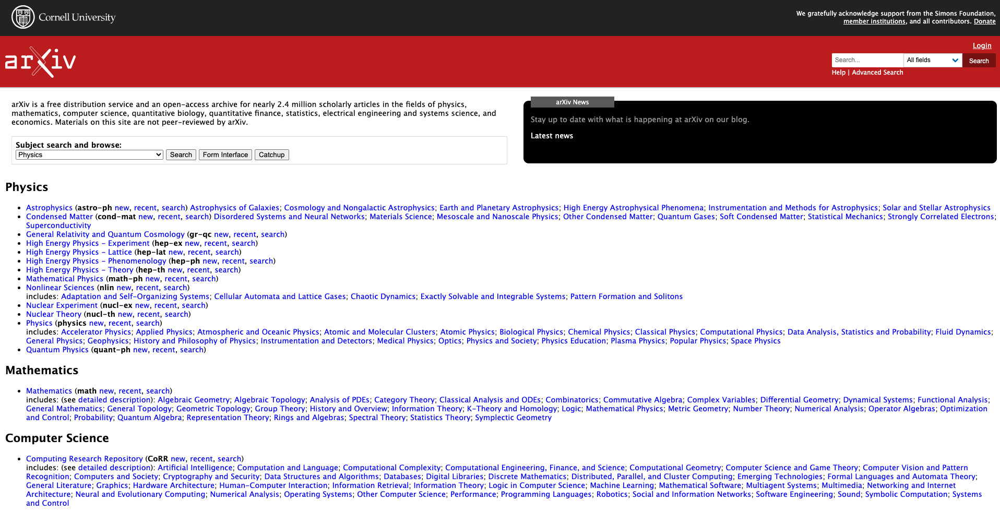
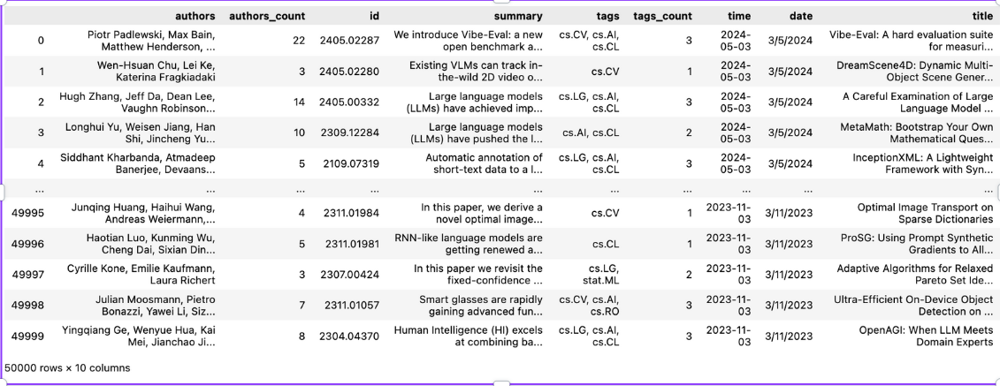
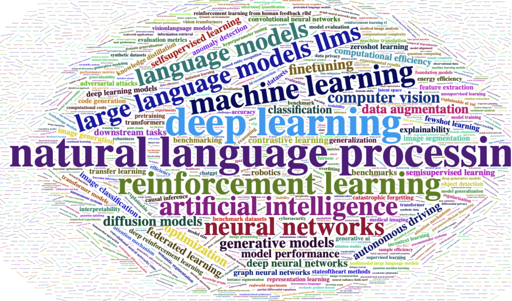
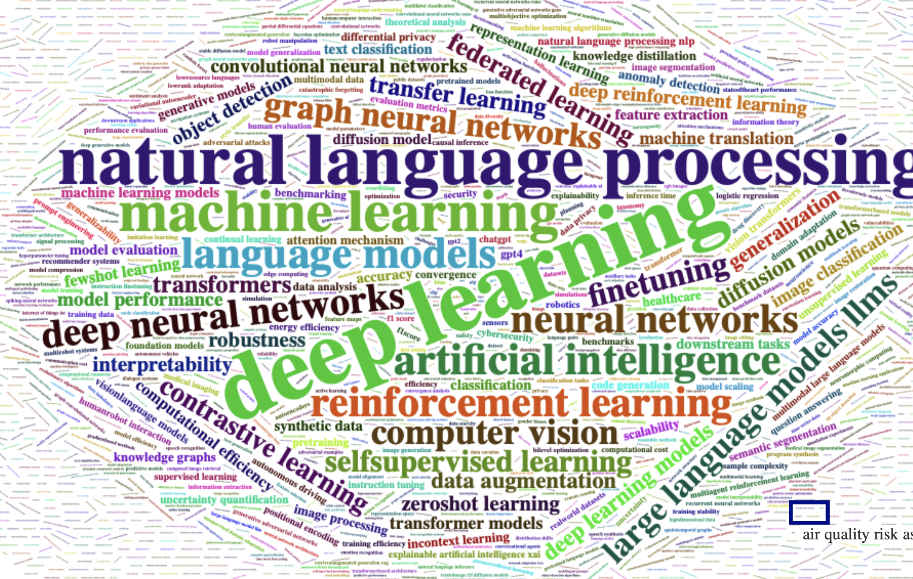
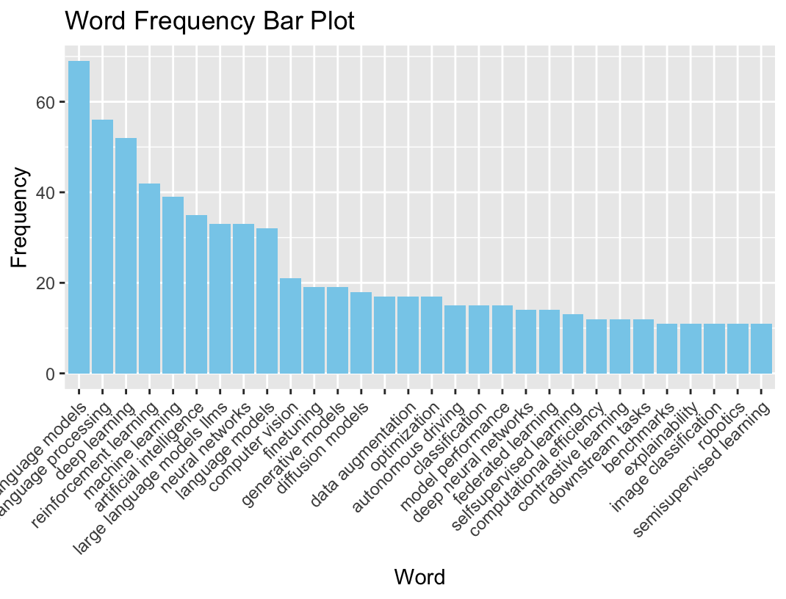
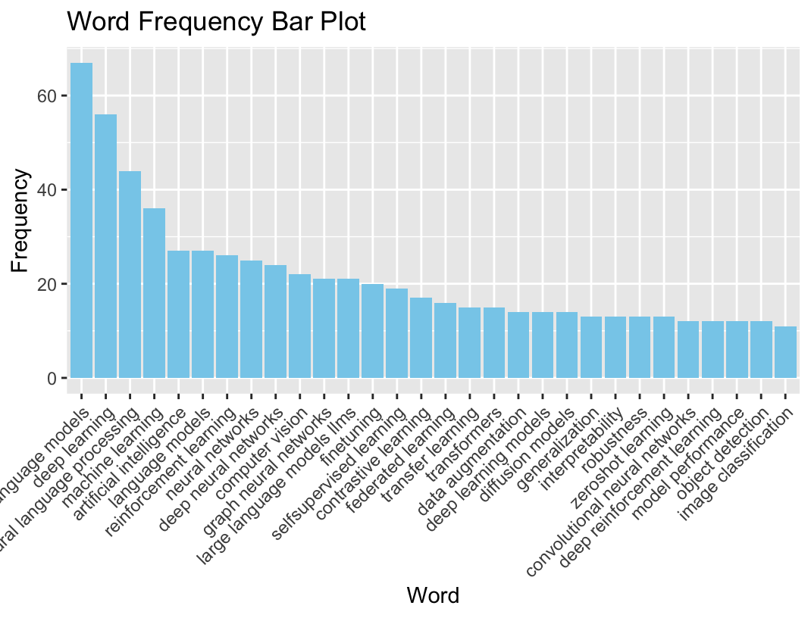
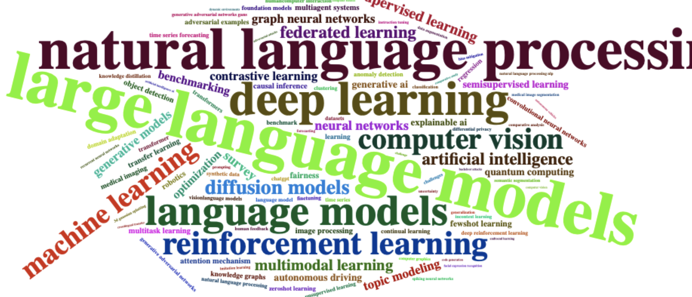
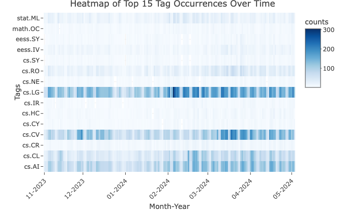
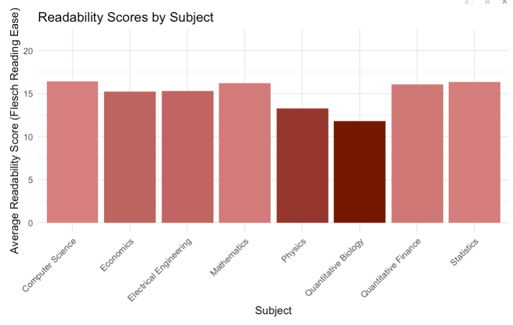

# Project:  Unveiling Research Trends with arXiv Data Visualization 

**Data:** 

[`data`](https://github.com/mtuann/comp5120-data-vis/blob/main/project02/arxiv05_v2.csv)
*High-Level Goal:** To leverage data visualization techniques to explore emerging research trends within the vast collection of arXiv open access preprints.

**Goals and Motivation:** 

The ever-growing volume of scientific research published on arXiv presents a challenge in staying abreast of current trends and identifying groundbreaking advancements. Our project aims to address this challenge by creating a suite of data visualizations that unveil hidden patterns and trends within arXiv preprints. By analyzing titles, abstracts, and potentially other metadata (depending on data availability), we can provide researchers with valuable insights into:

- **Emerging research areas:** Identifying rapidly growing topics and potential breakthroughs across different scientific disciplines.
- **Shifting trends:** Tracking changes in research focus over time and identifying potential paradigm shifts within specific fields.
<!-- - **Collaboration patterns:** Visualizing co-authorship networks to understand research communities and collaborations driving innovation.
- **Author productivity:** Highlighting highly productive researchers and their areas of focus. -->

This project presents a novel approach to navigating the vast ocean of arXiv preprints. By leveraging data visualization, we can bridge the gap between raw data and actionable insights, empowering researchers to make informed decisions about their own research directions and collaborations.

**Research Question:**

How can data visualization techniques be used to uncover and communicate emerging trends within the arXiv open access preprints collection?

**Data Collection and Approach:**

We utilize existing tools and libraries to crawl data from arXiv preprints. This data include titles, abstracts, publication dates, author affiliations, and potentially other relevant metadata fields depending on availability. Our data are collected from 2023-11-03 to 2024-05-03 with 50.000 Computer Science (2000 pages * 25 papers/ page) papers in 8 subjects:

  - Economics
  - Electrical Engineering and Systems Science
  - Computer Science
  - Mathematics
  - Physics
  - Quantitative Biology
  - Quantitative Finance
  - Statistics

## Question 1: How has the number of preprints in different research areas related to Computer Science changed over time?

## Question 2: What are the most common keywords in the titles and abstracts of preprints in the field of Computer Science?

## Analysis of research topic frequencies over time

The topics clouds extracted from the abstracts of arXiv Computer Science papers for January and April 2024 provide a visual representation of keyword frequencies and highlight shifts in research focus over the span of three months.

January 2024
In January, the cloud prominently features "natural language processing," "deep learning," and "machine learning" as central themes, reflecting a strong emphasis on foundational AI technologies. The presence of "language models" and "neural networks" underscores ongoing interest in model architectures and optimization techniques.

April 2024
By April, the cloud retains a strong presence of similar themes but with noticeable increases in "computer vision" and "reinforcement learning," indicating a pivot towards these applications. Newer terms like "diffusion models" and "federated learning" suggest a growing interest in generative models and privacy-preserving machine learning techniques while terms like "explainable", "graph neural network" disappeared.

Consistent Core Areas: Despite the shifts, core areas like "deep learning," "machine learning," and "natural language processing" remain consistently prominent, indicating their foundational role in Computer Science research.

### Barplot top 30 most frequency terms

Newer terms like "diffusion models" and "federated learning" suggest a growing interest in generative models and privacy-preserving machine learning techniques. On the other hand, terms like "explainable", "graph neural network" are excluded from top used term.

The topics cloud visually encapsulates key research trends in the Computer Science field, highlighting "large language models" and "natural language processing" as highly prominent areas. This indicates significant research activity focused on advancing language understanding technologies. "Deep learning" and "machine learning" are central, underscoring their foundational role in developing advanced computational methods. The term "artificial intelligence" spans various aspects, reflecting its broad and sustained research interest. Emerging terms like "federated learning" and "diffusion models" suggest growing interest.

### Heatmap of Top 15 Tag Occurrences Over Time

The heatmap visualization delineates the occurrences of the top 15 tags associated with research topics over a six-month period, from December 2023 to May 2024.

The tags, representing various subfields such as machine learning ('cs.LG'), computer vision ('cs.CV'), and artificial intelligence ('cs.AI'), show varying levels of activity each month. Notably, the tag 'cs.CV' exhibited consistently high activity, indicating a strong and sustained focus on computer vision research.

In contrast, 'cs.AI' showed fluctuating levels of lower activity, suggesting a more variable interest in artificial intelligence topics over the observed period.

This heatmap allows us to pinpoint which research areas are garnering more attention and which are experiencing declines or fluctuations.

## Text complexity analysis across scientific disciplines

Readability scores across various scientific disciplines are examined using the Flesch Reading Ease formula. The disciplines analyzed include Computer Science, Economics, Electrical Engineering, Mathematics, Physics, Quantitative Biology, Quantitative Finance, and Statistics.

The scores are indicative of how accessible the text in research papers is, with higher scores suggesting easier readability.

The findings show that Computer Science and Economics possess the highest readability scores, implying that research papers in these fields are comparatively easier to comprehend. This could be due to more straightforward language or less dense jargon compared to other fields.

On the other hand, Physics and Quantitative Biology have lower readability scores, reflecting the potential complexity of the language and concepts used in these papers. Such data is crucial for academic publishers and educational institutions as it highlights the need for different levels of simplification or explanation to aid understanding depending on the field.

# Conclusion:
In this study, we have developed a suite of data visualizations to uncover hidden patterns and trends within arXiv preprints, focusing specifically on the field of Computer Science. By analyzing the titles, abstracts, and metadata of a comprehensive dataset of arXiv submissions, we have successfully provided valuable insights into the dynamic landscape of scientific research.

Our analysis highlights several key findings:.
- **Rapidly Growing Number of papers:** Rapidly growing number of paper Computer Science.
- **Trends:** analysis revealed a set of common terms frequently appearing in the titles and abstracts of Computer Science preprints. 

The visualizations and insights presented in this paper provide researchers, policymakers, and funding agencies with a clearer understanding of the evolving landscape of Computer Science research. By identifying rapidly growing topics and tracking changes in research focus, stakeholders can make informed decisions regarding research directions. Our work demonstrates the power of data-driven approaches in analyzing large-scale scientific data. The methodologies and findings of this study can be extended to other disciplines and datasets, offering a scalable solution for monitoring and understanding the progress of scientific research in the modern era. Future work could include expanding the dataset, incorporating more sophisticated natural language processing techniques, and developing predictive models to forecast future research trends.
